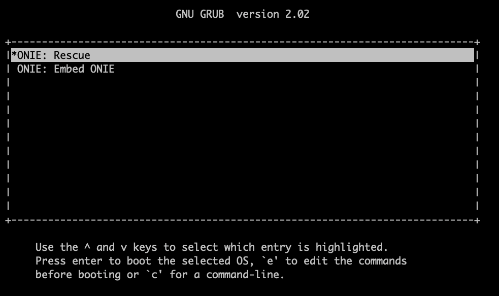

# ONIE Vagrant box

## Tested with following tools

- Vagrant 2.2.13
- Packer 1.6.5
- Socat 1.7.3.4

## Build the box

**You can skip this step if you want to use Vagrant box only.**

To build the Vagrant box, you need to first start a ONIE VM from ONIE iso image.

You can build the ONIE image from scratch or use the one provided in this repo.

Here we use VirtualBox to start and install ONIE, below are some parameters for the VM

- Name: onie
- Type: Linux
- Version: Other Linux (64-bit)
- Memory size: Default, Can change later after install the NOS
- Disk size: Default, depends on the size of NOS that will be install later
- Storage
  - The hard disk should be under SATA controller instead of IDE or else
  - Add ONIE iso as a CD-ROM
- Serial ports
  - Enable Port 1
  - Port Number: COM1
  - IRQ, I/O Port: default
  - Port Mode: TCP
  - Check "Connect to exisiting pipe/socket"
  - Path/Address: 127.0.0.1:8999 (can choose port you like)

After VM created, we need to start a server so the serial port can use

Here use use `socat` tool to create a server.

```bash
socat file:`tty`,raw,echo=0 tcp-listen:8999
```

After socat started, we can start the VM, and you shoud be able to see the GRUB UI from the terminal that socat is running.



Go to `ONIE: Embed ONIE` to install the ONIE.

This shoud takes few minuts, you can shutdown the VM when you see `Post installation hook`. The ONIE will keep installing again and again if you don't do anything.

Use `halt` command to halt the system, turn off the VM when you see `reboot: System halted`

Now you should remove the ONIE installer iso to prevent the VN booting from it.

You also need to remove the serial port setting since we don't need it when we pack it using packer.

After these process, we are ready to pack the VM as a Vagrant box.

```bash
packer build onie-vm.json
```

After build, you will get a new file in this directory called `packer_virtualbox-vm_virtualbox.box`

And you should be able to add the box by using the command:

```bash
vagrant box add ./packer_virtualbox-vm_virtualbox.box
```

## To use the ONIE box

By default, the system will enter ONIE install mode, which provide ssh access.

However, most of installers(e.g., ONL) requires using the console, so in Vagrantfile there
is a setting which enable the console/serial port.

Start the socat before start the VM

```bash
socat file:`tty`,raw,echo=0 tcp-listen:8999
```

After socat started, use `vagrant up` to start the VM.

And you will be able to access the GRUB and ONIE from the terminal that starts the socat.
